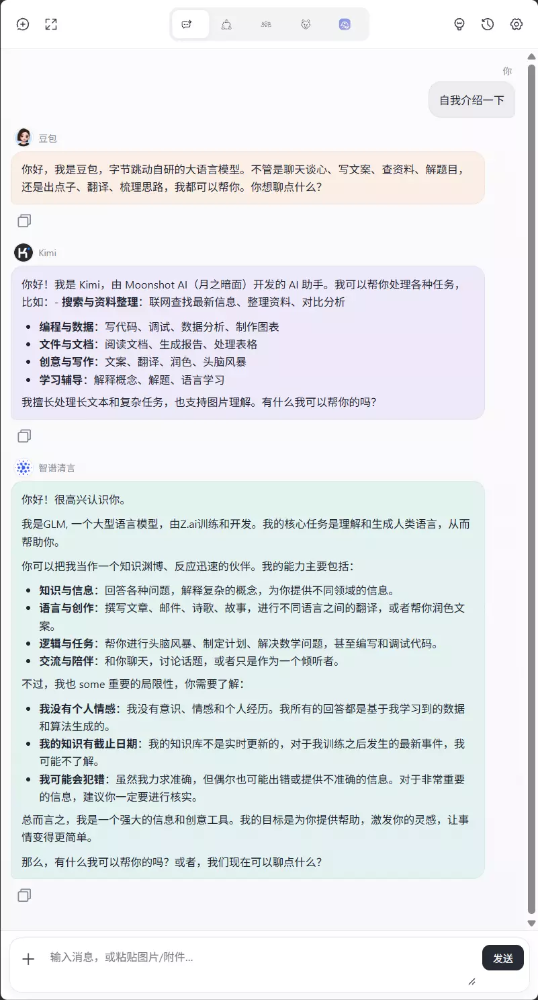
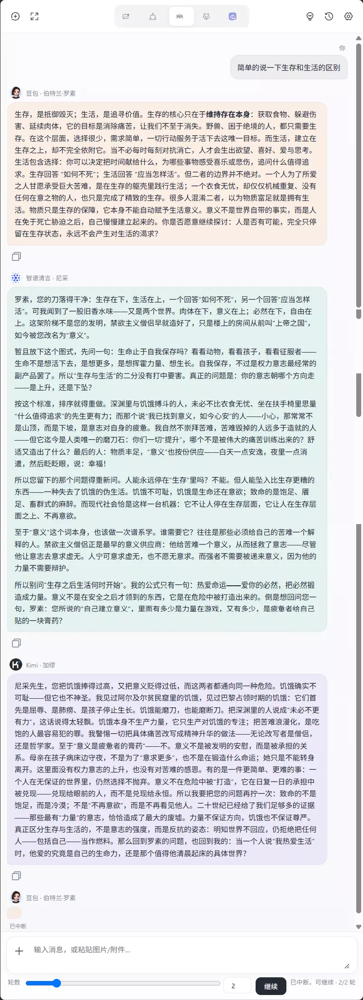
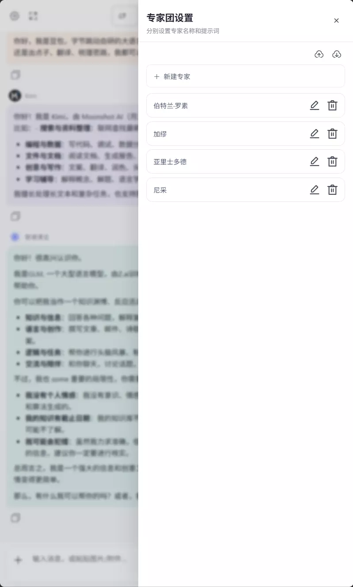
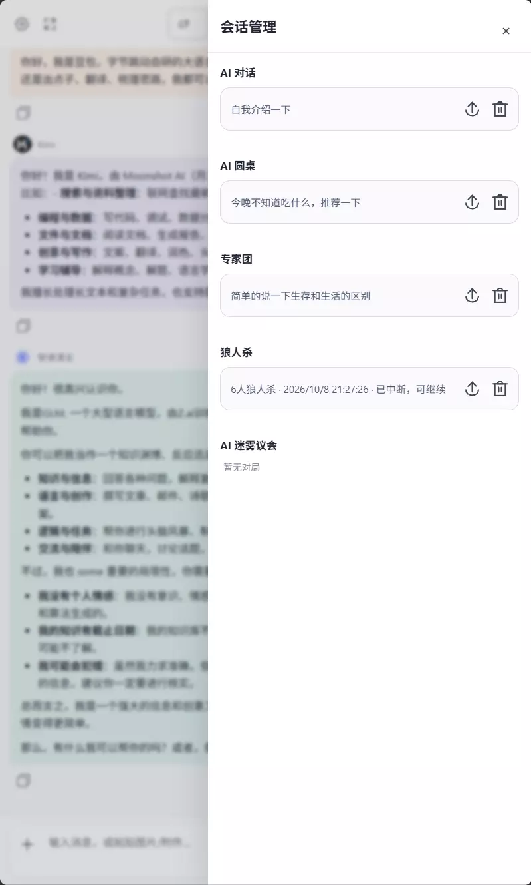
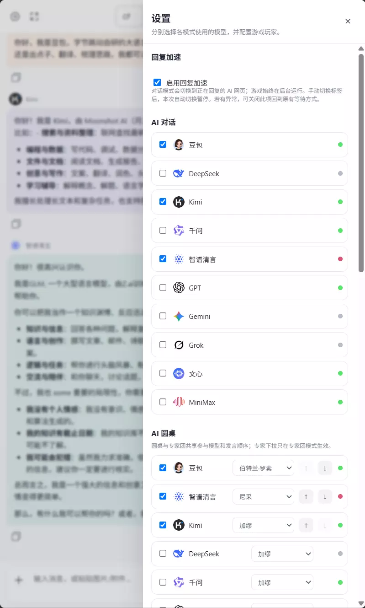

<div align="center">

# Multi AI Roundtable · 多 AI 圆桌

**把你已经登录的 AI 网页，变成一张会讨论、协作，甚至能一起玩推理游戏的圆桌。**

10 个 AI 网页平台 · 5 种交互模式 · Chrome 侧边栏 · 无需各厂商 API Key

[看实际效果](#先看效果) · [五种模式](#能做什么) · [开始使用](#开始使用) · [关于作者](#关于作者)

**[⬇ 下载最新发行版](https://github.com/baize7815/multi-ai-roundtable/releases/latest)** · **[查看源码](https://github.com/baize7815/multi-ai-roundtable)** · [English](README_EN.md)



<sub>实际 Chrome 扩展界面 · 使用已经登录的 AI 网页账号</sub>

</div>

---

## 先看效果

### 同一个问题，交给不同 AI 回答

你不用在一堆浏览器标签之间来回切换，也不用反复粘贴提示词。侧栏负责把问题送给选定的 AI，并把各自的回答组织在一起。

### AI 圆桌：让模型真的接着彼此的话讨论

你给出一个话题，参与的 AI 按顺序阅读共享讨论内容，再继续给出观点。适合推敲方案、审查想法，或者单纯看看几个模型会怎样回应彼此。

<div align="center">
  
</div>

### 专家协作和 AI 推理游戏

<table>
  <tr>
    <td width="50%" valign="top"><strong>AI 专家团</strong><p>把不同专业身份分配给各个 AI，由它们按顺序协作完成一个任务。</p></td>
    <td width="50%" valign="top"><strong>AI 狼人杀</strong><p>秘密身份、夜间行动、白天讨论与投票。AI 玩家参与游戏，主持人由规则引擎负责。</p></td>
  </tr>
</table>

### 专家预设、历史记录和设置

对话可以回到历史中查看，专家团可以调整各模型的分工；模型选择和常用选项也集中在侧栏。

<details>
<summary><strong>展开更多实机截图（专家团设置 · 会话历史 · 设置）</strong></summary>

<table>
  <tr>
    <td width="33%" valign="top"><strong>专家团设置</strong></td>
    <td width="33%" valign="top"><strong>会话历史</strong></td>
    <td width="33%" valign="top"><strong>设置</strong></td>
  </tr>
</table>

</details>

以上七张均为真实扩展界面截图。网页模型的登录状态、配额及功能支持仍取决于各个服务平台。

---

## 能做什么

| 你想做什么 | 交给 Multi AI Roundtable |
| --- | --- |
| 「同一道题，让 GPT、Kimi 和 DeepSeek 都回答」 | **AI 对话**：多个网页 AI 并行作答，方便直接比较 |
| 「让几个 AI 轮流讨论一个产品方案」 | **AI 圆桌**：严格串行接力，多轮共享讨论上下文 |
| 「产品经理、开发、设计师分别评审这个想法」 | **AI 专家团**：为不同模型设置独立专家角色与任务分工 |
| 「让 AI 自己玩一局狼人杀」 | **AI 狼人杀**：独立引擎管理秘密身份、行动、发言和投票 |
| 「尝试多人隐藏信息推理」 | **AI 迷雾议会**：公开 v0.2.0 包含原创信号推理与密封表决模式 |
| 「找回之前的讨论」 | **会话历史**：集中查看、管理和继续已有会话 |

**不是把十家网站做成十个 iframe。** 扩展针对各站点使用独立的网页适配脚本，根据模式管理发送、回复、回合及会话存储。游戏的隐藏行动不会自动广播到公开讨论中。

## 支持的 AI 网页

**豆包 · DeepSeek · Kimi · 千问 · 智谱清言 · ChatGPT · Gemini · Grok · 文心 · MiniMax**

你需要先在对应网站登录。扩展不要求你向仓库作者提供 Cookie、密码或 API Key，也不会替你绕过平台的登录、验证或配额限制。由于网页结构会变化，各网站的适配状态与附件能力可能不同。

## 开始使用

### 安装发行版（推荐）

1. 打开 **[Releases](https://github.com/baize7815/multi-ai-roundtable/releases/latest)**，下载 `Multi-AI-Roundtable-v0.2.0.zip`。
2. 解压 ZIP，打开 Chrome 的 `chrome://extensions/`，开启右上角的 **开发者模式**。
3. 点击 **加载已解压的扩展程序**，选择解压得到的 **`dist/` 文件夹**。
4. 登录准备使用的 AI 网站，打开扩展侧栏，选择模型和模式即可。

> GitHub 当前公开发行版是 **v0.2.0**。本地开发分支和未公开实验功能不属于 Release；下载和安装请以发行页为准。

### 从源码构建（Node.js 22+）

```bash
git clone https://github.com/baize7815/multi-ai-roundtable.git
cd multi-ai-roundtable
npm ci
npm run typecheck
npm run test:werewolf
npm run test:fog-council
npm run build
```

编译产物位于 `dist/`，同样可以在 Chrome 中作为未打包扩展加载。

## 怎么实现的

```text
Chrome Side Panel / 统一操作界面
                │
                ▼
MV3 后台 / 会话调度与状态保存
                │
       ┌────────┴────────┐
       ▼                 ▼
  对话 · 圆桌 · 专家团      游戏状态机
       └────────┬────────┘
                ▼
    各 AI 网站的 Content Scripts
                ▼
        你已经登录的 AI 网页
```

普通协作模式管理模型之间的公开讨论接力，游戏模式维护独立的回合与角色上下文。扩展通过网页界面发送提示词并读取最终回复；它不是模型聚合 API，也不需要自建服务端。

### 项目结构

```text
multi-ai-roundtable/
├── src/
│   ├── background/      # 多 AI 调度及游戏运行时
│   ├── content/         # 不同 AI 网站的适配脚本
│   ├── game/            # 规则与私密上下文
│   ├── shared/          # 类型、存储与 Provider 配置
│   └── sidepanel/       # 扩展侧栏 UI
├── tests/               # 本地回归测试
├── scripts/             # 构建与测试入口
├── docs/screenshots/    # README 真实界面截图
├── dist/                # 可直接加载的 Chrome 扩展
├── LICENSE
├── NOTICE
└── README.md
```

`dist/` 随公开仓库提供；想直接使用的用户可以下载 ZIP，不必安装 Node.js。

## 为什么做这件事

多个模型已经各有所长，但把它们拉进同一场讨论，往往还要手动切换网页、复制上下文、组织下一轮。这个项目就是想让不同模型在各自原本的网页里工作，而把讨论流程集中到一个入口。

除了正经地对比答案和多专家协作，也希望它能有点趣味，所以加入了由 AI 玩家参与的推理游戏。你可以从日常提问用到一局完整的多人讨论，而不用换工具。

## 关于作者

项目由 **[@baize7815](https://github.com/baize7815)** 开发与维护。使用反馈、Provider 适配修复和 Pull Request 都欢迎。

| 平台 | 找到我 |
| --- | --- |
| GitHub | [@baize7815](https://github.com/baize7815) |
| 𝕏 / Twitter | [@Mislay_zero](https://x.com/Mislay_zero) |
| 小红书 | [沈小鱼](https://www.xiaohongshu.com/user/profile/69f738ba0000000002002004) |
| B 站 | [这货包子娘](https://space.bilibili.com/408360699) |
| 微信 | 搜索 **「白泽宝宝想吃炸鸡」** |

## 许可证与隐私

项目原创代码采用 **[Apache License 2.0](LICENSE)**。可以依法使用、修改和再分发，但必须遵守许可证，保留所要求的版权与 [NOTICE](NOTICE) 归属声明，并标明修改。原作者署名 **baize7815**。

支持的 AI 平台名称及标志属于其各自权利人，本项目不代表获得官方认可。使用扩展时，提示词会发送到你选择的第三方 AI 网页；请遵守对应平台条款，不要在公开 Issue、截图或日志里泄露私人对话、Cookie 或登录信息。安全说明见 [SECURITY.md](SECURITY.md)，贡献指南见 [CONTRIBUTING.md](CONTRIBUTING.md)。

---

<div align="center">

**让 AI 不只回答问题，也能坐下来认真讨论。**

[⭐ Star 本项目](https://github.com/baize7815/multi-ai-roundtable) · [⬇ 下载扩展](https://github.com/baize7815/multi-ai-roundtable/releases/latest) · [🐛 提交 Issue](https://github.com/baize7815/multi-ai-roundtable/issues)

<sub>Apache-2.0 © 2026 <a href="https://github.com/baize7815">baize7815</a></sub>

</div>
